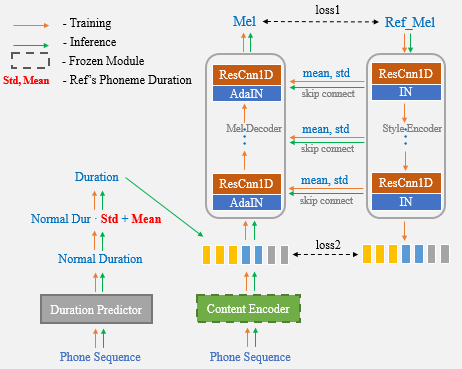

## Unet-TTS: Improving Unseen Speaker and Style Transfer in One-shot Voice Cloning
[](http://choosealicense.com/licenses/mit/)

> English | [中文](README-CN.md)

:exclamation: Now we provide inferencing code and pre-training models. You could generate any text sounds you want.

:star: The model training only uses the corpus of neutral emotion, and does not use any strongly emotional speech.

:star: There are still great challenges in out-of-domain style transfer. Limited by the training corpus, it is difficult for the speaker-embedding or unsupervised style learning (like GST) methods to imitate the unseen data.

:star: With the help of Unet network and AdaIN layer, our proposed algorithm has powerful speaker and style transfer capabilities.

[Infer code](notebook) or [Colab notebook](https://colab.research.google.com/drive/1sEDvKTJCY7uosb7TvTqwyUdwNPiv3pBW#scrollTo=puzhCI99LY_a)

[Demo results](https://cmsmartvoice.github.io/Unet-TTS/)

[Paper link](https://arxiv.org/abs/2109.11115)



---
:star: Now, you only need to use the reference speech for one-shot voice cloning and no longer need to manually enter the duration statistics additionally.

:smile: The authors are preparing simple, clear, and well-documented training process of Unet-TTS based on Aishell3.

It contains:

- [x] One-shot Voice cloning inference
- [x] The duration statistics of the reference speech can be estimated Automatically using Style_Encoder.
- [ ] Multi-speaker TTS with speaker_embedding-Instance-Normalization, and this model provides pre-training Content Encoder.
- [ ] Unet-TTS training
- [ ] C++ inference

 Stay tuned!

---
### Install Requirements
- Install the appropriate TensorFlow and tensorflow-addons versions according to CUDA version. 
- The default is TensorFlow 2.6 and tensorflow-addons 0.14.0.
```shell
cd One-Shot-Voice-Cloning/TensorFlowTTS
pip install . 
(or python setup.py install)
```

### Usage
Option 1: Modify the reference audio file to be cloned in the UnetTTS_syn.py file. (See this file for more details)
```shell
cd One-Shot-Voice-Cloning
CUDA_VISIBLE_DEVICES=0 python UnetTTS_syn.py
```

Option 2: Notebook

**Note**: Please add the One-Shot-Voice-Cloning path to the system path. Otherwise the required class UnetTTS cannot be imported from the UnetTTS_syn.py file.
```python
import sys
sys.path.append("<your repository's parent directory>/One-Shot-Voice-Cloning")
from UnetTTS_syn import UnetTTS

from tensorflow_tts.audio_process import preprocess_wav

"""Inint models"""
models_and_params = {"duration_param": "train/configs/unetts_duration.yaml",
                    "duration_model": "models/duration4k.h5",
                    "acous_param": "train/configs/unetts_acous.yaml",
                    "acous_model": "models/acous12k.h5",
                    "vocoder_param": "train/configs/multiband_melgan.yaml",
                    "vocoder_model": "models/vocoder800k.h5"}

feats_yaml = "train/configs/unetts_preprocess.yaml"

text2id_mapper = "models/unetts_mapper.json"

Tts_handel = UnetTTS(models_and_params, text2id_mapper, feats_yaml)

"""Synthesize arbitrary text cloning voice using a reference speech""" 
wav_fpath = "./reference_speech.wav"
ref_audio = preprocess_wav(wav_fpath, source_sr=16000, normalize=True, trim_silence=True, is_sil_pad=True,
                    vad_window_length=30,
                    vad_moving_average_width=1,
                    vad_max_silence_length=1)

# Inserting #3 marks into text is regarded as punctuation, and synthetic speech can produce pause.
text = "一句话#3风格迁移#3语音合成系统"

syn_audio, _, _ = Tts_handel.one_shot_TTS(text, ref_audio)
```

### Reference
https://github.com/TensorSpeech/TensorFlowTTS

https://github.com/CorentinJ/Real-Time-Voice-Cloning
